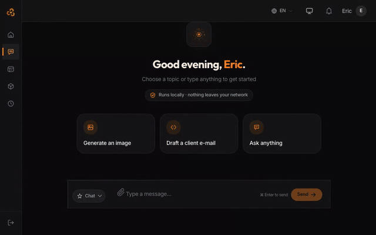
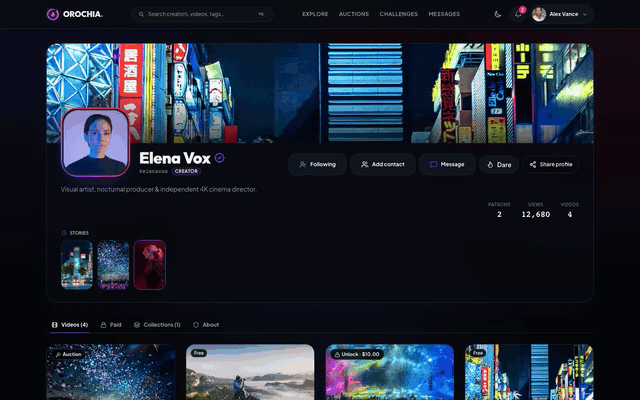

<div align="center">

<picture>
  <source media="(prefers-color-scheme: dark)" srcset="assets/krizaka-dark.svg">
  
</picture>

# Krizaka

### Open source. Closed to compromise.

We build what others take years to get right — AI that never leaves your walls, a video platform
that pays every cent exactly once. Compliance and security aren't add-ons: they're compiled in.

[Website](https://www.krizaka.com) · [Products](https://www.krizaka.com/en/products) · [Docs](https://www.krizaka.com/docs) · [Open source](https://www.krizaka.com/en/open-source) · [Contact](https://www.krizaka.com/en/contact)

</div>

---

<table>
<tr>
<td width="50%" valign="top">

<picture>
  <source media="(prefers-color-scheme: dark)" srcset="assets/orazaka-dark.svg">
  
</picture>

### Orazaka

**The AI that never leaves home.**

A multimodal AI orchestration engine — chat, RAG, agents, image, audio, video — where every request crosses a
deterministic interceptor pipeline to the best **local** model. Your documents, your models, your network: nothing
leaves it. Law 25 and GDPR by design. One command, `orazaka demo seed`, sets up Eric's day on your own machine.

[Workspace](https://github.com/krizaka/orazaka) · [Docs](https://www.krizaka.com/docs/orazaka) · [How it works](https://www.krizaka.com/en/products/orazaka/architecture) · [Demos](https://www.krizaka.com/en/products/orazaka/demos)

</td>
<td width="50%" valign="top">

<picture>
  <source media="(prefers-color-scheme: dark)" srcset="assets/orochia-dark.svg">
  
</picture>

### Orochia

**Creators get paid. Every cent, exactly once.**

The creator video platform: direct-to-CDN 4K streaming, an **Explorer** that is never empty, complete **stories**
(sound, likes, tips, private replies), audiences the creator chooses, **auctions** and **challenges** paid in credits
held in escrow until delivery. Creators keep **90 %**, settled once on a double-entry ledger. Built-in 18+
compliance — on the web and on iOS and Android ([orochia-mobile](https://github.com/krizaka/orochia-mobile)).

[Try it](https://dev.orochia.com) · [Repository](https://github.com/krizaka/orochia) · [Docs](https://www.krizaka.com/docs/orochia) · [Video tour](https://www.krizaka.com/en/products/orochia#tour)

</td>
</tr>
</table>

<table>
<tr>
<td width="50%" valign="top"></td>
<td width="50%" valign="top"></td>
</tr>
<tr>
<td align="center"><sub>Orazaka — Eric answers a customer from his own documents, then generates the product photo. Everything ran on one Mac. <a href="https://www.krizaka.com/en/products/orazaka/demos">More demos</a></sub></td>
<td align="center"><sub>Orochia — the 18+ gate, the home, the latest streams, a creator's page. <a href="https://dev.orochia.com">Try it</a></sub></td>
</tr>
</table>

## Start here

| You want to… | Go to |
| :--- | :--- |
| **See the products** | [krizaka.com/products](https://www.krizaka.com/en/products) · Orochia running: [dev.orochia.com](https://dev.orochia.com) · Orazaka: [demos](https://www.krizaka.com/en/products/orazaka/demos) |
| **Read the docs** | One place, [krizaka.com/docs](https://www.krizaka.com/docs): [Orazaka](https://www.krizaka.com/docs/orazaka) · [Orochia](https://www.krizaka.com/docs/orochia) · [UI components](https://www.krizaka.com/docs/ui) · [Java building blocks](https://www.krizaka.com/docs/java) |
| **Run Orochia locally** | [`krizaka/orochia`](https://github.com/krizaka/orochia) — `npm run setup && npm run dev` (Node ≥ 20, Docker) |
| **Run Orazaka locally** | [`krizaka/orazaka`](https://github.com/krizaka/orazaka) — clones every component; the [`orazaka` CLI](https://github.com/krizaka/orazaka-cli) does install → start → dev, and `orazaka demo seed` loads the demo |
| **Understand the architecture** | [Orazaka, interactive](https://www.krizaka.com/en/products/orazaka/architecture) · [Orochia docs](https://www.krizaka.com/docs/orochia) |
| **Contribute** | [Contributing](https://github.com/krizaka/.github/blob/main/CONTRIBUTING.md) · good first issues in each repository · [Code of conduct](https://github.com/krizaka/.github/blob/main/CODE_OF_CONDUCT.md) |
| **Report a vulnerability** | Privately — [Security policy](https://github.com/krizaka/.github/blob/main/SECURITY.md) |
| **Talk to the team** | [krizaka.com/contact](https://www.krizaka.com/en/contact) · GitHub Discussions in each product repository |

## Pick only what you need

Every product is built on **Krizaka building blocks** — open-source components any application can take on its own,
published on Maven Central and npm. The products consume them; they do not own them.

| Layer | Repositories |
| :--- | :--- |
| **Building blocks** (Java, `com.krizaka`) | [`krizaka-build`](https://github.com/krizaka/krizaka-build) — parent POM, BOM, test kit · [`krizaka-platform-kit`](https://github.com/krizaka/krizaka-platform-kit) — web, security, messaging, observability and their Spring Boot starters · [`krizaka-users`](https://github.com/krizaka/krizaka-users) — sign-up, sign-in, OAuth, profiles, API keys · [`krizaka-notifications`](https://github.com/krizaka/krizaka-notifications) — e-mail, SMS, webhooks · [`krizaka-billing`](https://github.com/krizaka/krizaka-billing) — credits, plans, metering |
| **Building blocks** (TypeScript, `@krizaka`) | [`krizaka-ui`](https://github.com/krizaka/krizaka-ui) — tokens, Tailwind preset, primitives, marks, icons, i18n and shared config for every Krizaka interface |
| Orazaka — foundation | [`orazaka-build`](https://github.com/krizaka/orazaka-build) · [`orazaka-contracts`](https://github.com/krizaka/orazaka-contracts) · [`orazaka-edge`](https://github.com/krizaka/orazaka-edge) · [`orazaka-ui-kit`](https://github.com/krizaka/orazaka-ui-kit) |
| Orazaka — AI engine | [`orazaka-studio`](https://github.com/krizaka/orazaka-studio) · [`orazaka-ai-engine`](https://github.com/krizaka/orazaka-ai-engine) · [`orazaka-conversation-service`](https://github.com/krizaka/orazaka-conversation-service) · [`orazaka-job-service`](https://github.com/krizaka/orazaka-job-service) · [`orazaka-knowledge-service`](https://github.com/krizaka/orazaka-knowledge-service) · [`orazaka-automation-service`](https://github.com/krizaka/orazaka-automation-service) · [`orazaka-worker-media`](https://github.com/krizaka/orazaka-worker-media) |
| Orazaka — applications | [`orazaka-web-client`](https://github.com/krizaka/orazaka-web-client) · [`orazaka-web-admin`](https://github.com/krizaka/orazaka-web-admin) · [`orazaka-mobile-client`](https://github.com/krizaka/orazaka-mobile-client) · [`orazaka-cli`](https://github.com/krizaka/orazaka-cli) · [`orazaka-packs`](https://github.com/krizaka/orazaka-packs) |
| Orochia | [`orochia`](https://github.com/krizaka/orochia) · [`orochia-admin`](https://github.com/krizaka/orochia-admin) · [`orochia-design-system`](https://github.com/krizaka/orochia-design-system) · [`orochia-mobile`](https://github.com/krizaka/orochia-mobile) |
| Site & organisation | [`krizaka-com`](https://github.com/krizaka/krizaka-com) · [`.github`](https://github.com/krizaka/.github) — this profile, community defaults and the shared Maven pipeline |

Clone the whole Orazaka platform — building blocks included — with [`krizaka/orazaka`](https://github.com/krizaka/orazaka).

## Artifacts on Maven Central

[](https://central.sonatype.com/artifact/com.krizaka/krizaka-bom)

Import the BOM once, add a starter, and every `com.krizaka` artifact resolves to one coherent release —
**0.2.0 is out**, signed (`B523D2E9DE35AE17882361BE25DF268F9213EB5D`, on keyserver.ubuntu.com).

| Artifact | Version | What it is |
| :--- | :--- | :--- |
| `com.krizaka:krizaka-bom` | 0.2.0 | Every Krizaka artifact at one version — changes no third-party version |
| `com.krizaka:krizaka-spring-boot-starter-web` · `-security` · `-rabbitmq` · `-observability` | 0.2.0 | One dependency each: the module below and its auto-configuration |
| `com.krizaka:krizaka-web` | 0.2.0 | RFC 9457 problem details, the correlation id, pagination and JSON written once |
| `com.krizaka:krizaka-security` | 0.2.0 | Local session-JWT verification, the baseline every filter chain starts from, `SERVICE` tokens |
| `com.krizaka:krizaka-messaging` | 0.2.0 | Events with their envelope in AMQP headers, a transactional outbox, atomic deduplication, retry and dead-letter topology |
| `com.krizaka:krizaka-observability` | 0.2.0 | Traces, metrics and structured logs on OpenTelemetry and Micrometer |
| `com.krizaka:krizaka-test-support` | 0.2.0 | ArchUnit code rules, configuration-binding checks and Testcontainers helpers |
| `com.krizaka:krizaka-parent` | 0.2.0 | The parent POM: Central metadata, Java 21 conventions, the signed release |
| `com.krizaka:krizaka-users-api` · `-client` · `-core` · `-persistence` | **0.1.0** | User management as a contract, a typed client, or a library |
| `com.krizaka:krizaka-notifications-api` | **0.1.0** | Request an e-mail, SMS or webhook notification |
| `com.krizaka:krizaka-billing-api` · `-client` | **0.1.0** | Credits, entitlements and metering as a contract and a typed client |

> [!NOTE]
> The 0.2.0 BOM already manages users, notifications and billing at 0.2.0, but those are published at **0.1.0** —
> their 0.2.0 ships in November. Until then, declare them with `<version>0.1.0</version>`.

A service with the starters:

```xml
<dependencyManagement>
  <dependencies>
    <dependency>
      <groupId>com.krizaka</groupId>
      <artifactId>krizaka-bom</artifactId>
      <version>0.2.0</version>
      <type>pom</type>
      <scope>import</scope>
    </dependency>
  </dependencies>
</dependencyManagement>

<dependencies>
  <!-- problem details, correlation id, pagination -->
  <dependency>
    <groupId>com.krizaka</groupId>
    <artifactId>krizaka-spring-boot-starter-web</artifactId>
  </dependency>
  <!-- session JWT and SERVICE tokens -->
  <dependency>
    <groupId>com.krizaka</groupId>
    <artifactId>krizaka-spring-boot-starter-security</artifactId>
  </dependency>
  <!-- outbox, deduplication, retry / DLQ -->
  <dependency>
    <groupId>com.krizaka</groupId>
    <artifactId>krizaka-spring-boot-starter-rabbitmq</artifactId>
  </dependency>
  <!-- published at 0.1.0 until November: pin it -->
  <dependency>
    <groupId>com.krizaka</groupId>
    <artifactId>krizaka-users-client</artifactId>
    <version>0.1.0</version>
  </dependency>
</dependencies>
```

[All artifacts →](https://central.sonatype.com/namespace/com.krizaka) · [Java docs](https://www.krizaka.com/docs/java) · [How they fit together](https://www.krizaka.com/en/open-source#maven)

## Packages on npm

Every interface is built from layers published on the public npm registry — no account or token to install. Releases
are published by the team from a reviewed `main`; provenance attestations come once trusted publishing is configured.

| Package | What it is |
| :--- | :--- |
| [](https://www.npmjs.com/package/@krizaka/ui) | The platform's components: the brand marks, ~32 web primitives on the `--kz-*` tokens, their React Native counterparts and section backdrops |
| [](https://www.npmjs.com/package/@krizaka/tokens) | The semantic design tokens and the three brand themes — CSS (dark, light), typed constants, React Native themes |
| [](https://www.npmjs.com/package/@krizaka/tailwind) | The Tailwind CSS v4 preset: the tokens as utilities |
| [](https://www.npmjs.com/package/@krizaka/icons) | The signature icons, one drawing language — React and React Native |
| [](https://www.npmjs.com/package/@krizaka/intl) | Money, numbers, dates and plurals formatted the same way everywhere — money from integer minor units only |
| [](https://www.npmjs.com/package/@krizaka/i18n) | Typed messages, `format()`, `<Rich>`, a React provider and the `krizaka-i18n` catalogue checker |
| [](https://www.npmjs.com/package/@krizaka/config) | ESLint, tsconfig and Prettier for every repository, and `krizaka-ratchet`, the UI debt counter |
| [](https://www.npmjs.com/package/@krizaka/orochia-design-system) | Orochia's identity on the platform: its theme and product composites (live badge, social icons) |
| [](https://www.npmjs.com/package/@krizaka/orazaka-design-system) | Orazaka's identity on the platform: the Orazaka Orange theme and product composites (chat showcase, icon registry) |
| [](https://www.npmjs.com/package/@krizaka/orazaka-shared) | Orazaka's contracts — TypeScript types, Zod schemas and design tokens |

[Component docs →](https://www.krizaka.com/docs/ui) · [All packages](https://www.npmjs.com/org/krizaka) · [How they fit together](https://www.krizaka.com/en/open-source#packages)

## How we work

- **One contract per product.** Every repository carries an `AGENTS.md` — the rules its code must keep
  (architecture, security, compliance) — that humans and AI agents follow alike.
- **Documentation generated from the code.** API contracts, database references, architecture maps and the
  [component docs](https://www.krizaka.com/docs/ui) — live previews and prop tables read from `@krizaka/ui` itself —
  are extracted from the sources and published on [krizaka.com/docs](https://www.krizaka.com/docs); they cannot drift.
- **Shared code is a package, never a copy.** Security, messaging, users, notifications and billing are released on
  Maven Central; tokens, primitives, marks and each product's identity on npm. Architecture rules fail the build on a
  local copy; a change lands in the package first.
- **UI debt only goes down.** Every interface lints with the shared UI rules (`--kz-*` tokens only — no raw palette
  colour, no `light:` variant — and no locale ternary); `krizaka-ratchet` records each repository's remaining debt
  and fails CI the moment a count goes up.
- **Supported, then deprecated, then removed.** Two majors are supported (N and N-1, fixes for six months); an API
  lives one full minor deprecated, with a codemod, before a major removes it — the
  [support policy](https://github.com/krizaka/krizaka-ui/blob/main/SUPPORT.md).
- **Tested on every commit.** Unit, architecture (ArchUnit) and end-to-end suites run in CI; a release
  never starts on an older database schema.

Everything is **Apache-2.0**, built and tested on every commit, documented from the code.

<sub>Made in Montréal · Open by default · Sovereign by design</sub>
